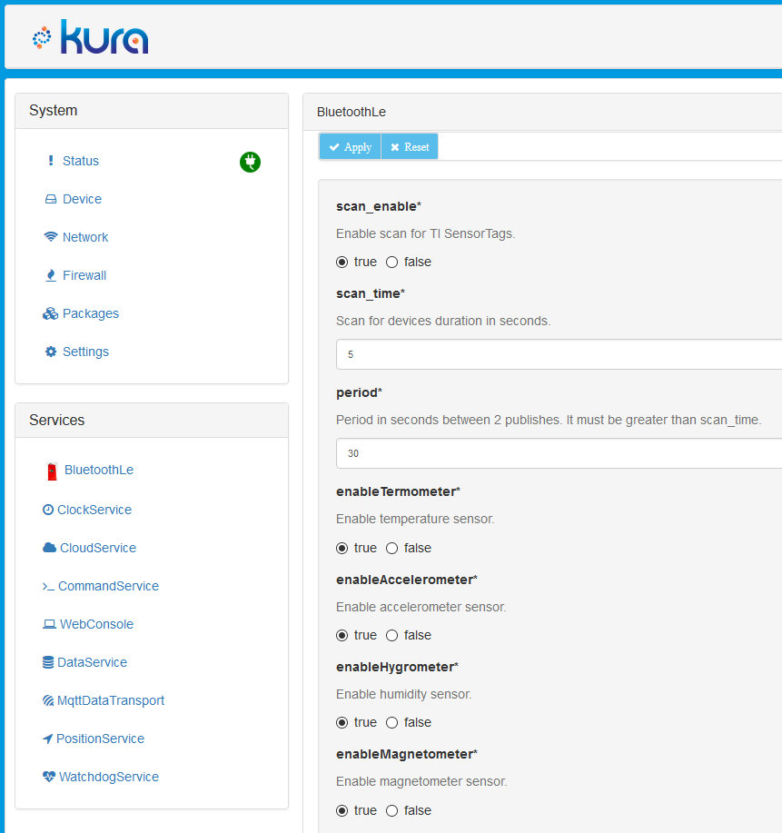

# IoT SensorTag + Rasberry PI + Apache Camel + Web live view

## Install:

#### Requirements:
1. Raspberry PI 3
2. TI SensorTag 2541 or TI SensorTag 2650

### TI SensorTag
- Using stock firmware  
- Or download BLE Stack from <http://www.ti.com/lit/zip/swrc258> and flash firmware CC2650SensorTag_BLE_All_v1_20.hex from %APPDIR%\Texas Instruments\SmartRF Tools\BLE Device Monitor\firmware\cc26xx\sensortag

### Raspberry PI
Install Raspbian from https://www.raspberrypi.org/downloads/ to Raspberry PI.

#### Install Eclipse Kura:
Become root and update package list `sudo -i && apt-get update`  
Install latest java (Better using Oracle java, `apt-get install oracle-java8-jdk`)  
Download latest version Raspbian (Model 2) - Stable from http://www.eclipse.org/kura/downloads.php (Example `wget http://mirrors.nic.cz/eclipse/kura/releases/2.0.2/kura_2.0.2_raspberry-pi-2_installer.deb`)  
`dpkg -i kura_*_installer.deb && apt-get install -f`  
Reboot Raspberry PI: `shutdown -r now`  
Now you can access Kura WEB UI with: http://\<rpi-device-ip\>. Default username/password: admin/admin.  

#### Install BlueZ for communication over BLE with SensorTag:
`apt-get install -y libusb-dev libdbus-1-dev libglib2.0-dev libudev-dev libical-dev libreadline-dev`  
`apt-get install bluez`  
Start bluetooth service: `systemctl enable bluetooth && systemctl start bluetooth`  
Enable bluetooth interface: `hciconfig hci0 up`. For check interface status type: `hciconfig -a`  

#### Install Mosquitto
**Mosquitto** - an open source message broker that implements the MQTT . We are using him for send sensors data from Rapberry PI for our backend services.  
You can install mosquitto to Raspberry PI or to other machine. If you can simple start all aplications with mosquitto skip this step.  
Instruction: https://mosquitto.org/2013/01/mosquitto-debian-repository/  
`apt-get install mosquitto`  
`systemctl enable mosquitto`  
Enable websocket in mosquitto:  
Add following lines to /etc/mosquitto/mosquitto.conf  
```
    # Websocket  
    listener 1883  
    listener 9001
    protocol websockets
```
and `systemctl start mosquitto`  

### Compile and deploy BLE TI SensorTag example:
https://github.com/leadex/kura - forked project from https://github.com/eclipse/kura which added reading temperature metric from barometer sensor.  
Checkout sources `git clone https://github.com/leadex/kura`  
`cd kura`  
I got to compile code only in linux.  
For compile just execute `./build-all.sh`  
For future compilation only ble example: 
```sh
kura/kura/examples/org.eclipse.kura.example.ble.tisensortag $ mvn clean install -D-Dmaven.test.skip=true
```  
Then copy compiled jar to Raspberry PI.  
`cd kura/examples/org.eclipse.kura.example.ble.tisensortag`  
`scp target/org.eclipse.kura.example.ble.tisensortag-*-SNAPSHOT.jar pi@<rpi-device-ip>:/tmp`  
Instruction for deploying bundles to Kura: http://eclipse.github.io/kura/doc/deploying-bundles.html  

#### Deploy  
Connect to OSGi console from Raspberry PI `telnet localhost 5002` or remotely `telnet <rpi-device-ip> 5002`  
Type `install file:///tmp/org.eclipse.kura.example.ble.tisensortag-1.0.3-SNAPSHOT.jar`  
and then `ss`. See new installed but not started bundle in tail: ‘75 INSTALLED org.eclipse.kura.example.ble.tisensortag’.  
Start it by `start 75` where 75 - id of bundle from previous step.  
Now it’s started: ‘75 ACTIVE org.eclipse.kura.example.ble.tisensortag’ and you can see logs on Raspberry PI by `tail -f /var/log/kura.log`  
In Kura web UI appeared new service BluetoohLe. Open and configure him.  

Instruction for permanent installation of JAR bundle: https://www.eclipse.org/forums/index.php/t/1054542/  

### Configure Kura:
- In **CloudService** set _encode.gzip_ to _false_
- In **MqttDataTransport** specify _broker-url_, _topic.context.account-name_

### Camel integration + Webview
For simple start MongoDB + Mosquitto + Webview you can type `docker-compose up -d`. That create 3 containers and expose mongodb, mqtt, websocket, http (8081) ports to localhost. Then webview become available by http://localhost:8081. And mqtt broker at localhost:1883, so you can configure Kura MqttDataTransport by you IP.

Example view:


#### Camel integration
**iot-backend-camel** contains Apache Camel project that subscribe to message broker and store KuraPayload with metrics from sensors to MongoDB.  
EclipseKura using Google Protobuf (https://developers.google.com/protocol-buffers/docs/javatutorial) for serializing Camel Route receive messages from mqtt broker. So we need using dependency com.google.protobuf:protobuf-java.  
For start camel app: `gradlew clean build` and `java -jar ./build/libs/iot-backend-camel-1.0.0-SNAPSHOT.jar`.  

#### Web view
**webview** contains docker image with nginx and html & js. Site uses mqtt over websocket paho library and highcharts for live view metrics from two sensors (Target temperature and light level).  

Probably you need change mqtt host in webview. It's does in `webview/dist/view.js`
```javascript
// Create a client instance
client = new Paho.MQTT.Client("localhost", Number(9001), "webview_" + parseInt(Math.random() * 1000000, 10));
```
You can restart webview by `docker-compose up -d --build`. That rebuild docker image and restart it if it's changed.  
